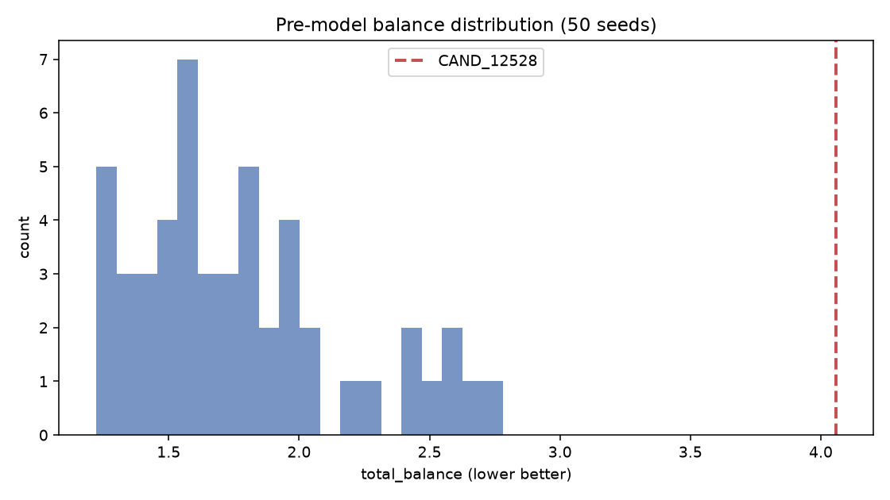

# 01 — Pre-model Split Landscape

- Seeds attempted: **50**; valid unique splits: **50**
- CAND_12528 pre-model rank among generated: **#51** (total_balance=4.059)
- Best new seed: **SEED_20260850** (total_balance=1.222)
- Landscape median total_balance: **1.683**; 12528 vs median: worse

## Typical / good / poor

- **Good** (top decile): total_balance ≤ 1.306
- **Typical** (median band): ~1.683
- **Poor** (bottom decile): total_balance ≥ 2.438

## Easier seeds?

Greedy+swap succeeds for most seeds; failures mainly duplicate hashes or HIGH-band constraint (must be 3/4). Lower total_balance seeds are not uniformly 'easier' — rank correlates weakly with seed index.

## HIC MED/HIGH vs TmApp

- MEDIUM 3/3 preferred: 41/50 seeds
- HIGH 3/4 or 4/3: all valid seeds satisfy by construction
- Improving HIC MED/HIGH band balance without worsening TmApp quantile L1 is possible for top seeds (see target_balance vs physchem_balance in CSV).

## Balance distribution

| split_id | premodel_rank | total_balance | target_balance | biology_balance | hic_med_pub | hic_med_priv | hic_high_pub | hic_high_priv |
| --- | --- | --- | --- | --- | --- | --- | --- | --- |
| SEED_20260850 | 1 | 1.2219877425269643 | 0.22222222222222227 | 0.5185185185185184 | 3 | 3 | 3 | 4 |
| SEED_20260901 | 2 | 1.2276665262161053 | 0.17283950617283955 | 0.6419753086419753 | 3 | 3 | 3 | 4 |
| SEED_20260854 | 3 | 1.229123222947212 | 0.22222222222222227 | 0.6913580246913579 | 3 | 3 | 4 | 3 |
| SEED_20260856 | 4 | 1.269961466759382 | 0.34567901234567905 | 0.5925925925925924 | 3 | 3 | 4 | 3 |
| SEED_20260917 | 5 | 1.2883152434324605 | 0.3703703703703704 | 0.493827160493827 | 3 | 3 | 3 | 4 |
| SEED_20260869 | 6 | 1.3085100521571238 | 0.34567901234567905 | 0.5185185185185185 | 3 | 3 | 4 | 3 |
| SEED_20260840 | 7 | 1.320687384308971 | 0.24691358024691362 | 0.5679012345679012 | 3 | 3 | 3 | 4 |
| SEED_20260897 | 8 | 1.3461261612552684 | 0.29629629629629634 | 0.49382716049382713 | 3 | 3 | 4 | 3 |
| SEED_20260860 | 9 | 1.3786006314298724 | 0.39506172839506176 | 0.5185185185185185 | 3 | 3 | 4 | 3 |
| SEED_20260851 | 10 | 1.4327535788775587 | 0.271604938271605 | 0.5185185185185184 | 3 | 3 | 3 | 4 |
| SEED_20260876 | 11 | 1.438404503580041 | 0.1481481481481482 | 0.5185185185185184 | 3 | 3 | 3 | 4 |
| SEED_20260838 | 12 | 1.4845647300683893 | 0.34567901234567905 | 0.493827160493827 | 3 | 3 | 3 | 4 |
| SEED_20260870 | 13 | 1.4980660694804913 | 0.24691358024691362 | 0.6172839506172838 | 3 | 3 | 3 | 4 |
| SEED_20260861 | 14 | 1.5129110833715893 | 0.29629629629629634 | 0.4444444444444443 | 3 | 3 | 4 | 3 |
| SEED_20260912 | 15 | 1.5325608726413291 | 0.46913580246913583 | 0.5925925925925926 | 3 | 3 | 4 | 3 |

