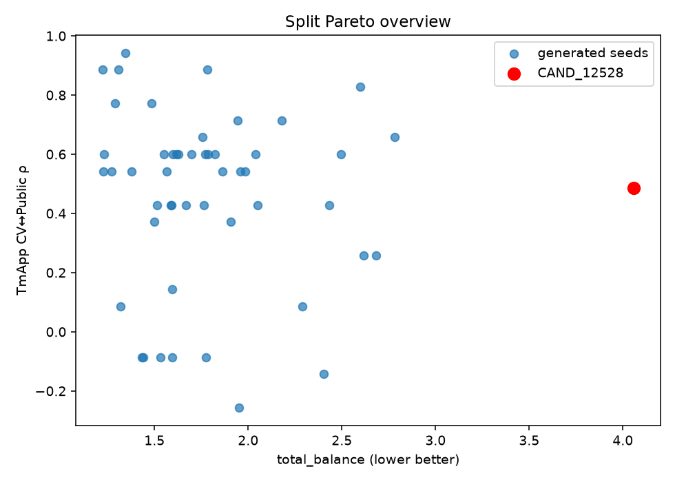

# 04 — Random Seed Typicality

All **50** generated seeds evaluated descriptively on selection bank (+ incumbent).

## Distribution summaries

- **TmApp CV↔Public ρ**: median=0.543, 12528=0.486, p10=-0.086, p90=0.771
- **TmApp Pub↔Priv ρ**: median=0.429, 12528=0.829, p10=-0.029, p90=0.886
- **HIC CV↔Public ρ**: median=0.486, 12528=0.486, p10=0.257, p90=0.714
- **HIC Pub↔Priv ρ**: median=0.771, 12528=0.771, p10=0.543, p90=0.829
- **TmApp Public-winner regret**: median=0.067, 12528=0.186, p10=0.000, p90=0.563
- **HIC Public-winner regret**: median=0.025, 12528=0.015, p10=0.006, p90=0.054

