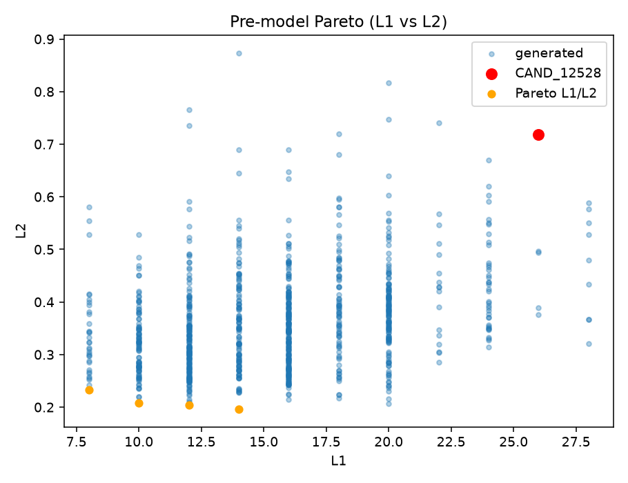
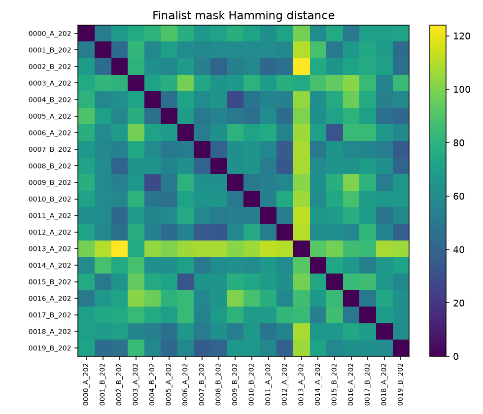

# 03 — Near-Optimal Split Landscape

- Best L1: **8.000**
- Near-optimal @5%: **34**; @10%: **34**; @20%: **34**
- Pairwise Hamming (sample of near-10%): median=66.0, min=28
- MEDIUM 3/3 among near-10%: **21** / 34
- Frozen diverse finalists: **20** (+ CAND_12528 control)

| split_id | is_control | rank | method | seed | L1 | L2 | L3 | L4 | TmApp_q8_L1 | HIC_q8_L1 | HIC_MED_imbalance | joint_grid_L1 | hic_med_pub | hic_high_pub | public_hash | private_hash |
| --- | --- | --- | --- | --- | --- | --- | --- | --- | --- | --- | --- | --- | --- | --- | --- | --- |
| GEN_0000_A_20261007 | False | 1.0 | A_greedy_swap | 20261007.0 | 8.0 | 0.23287325596398628 | 0.32510288065843623 | 1.1967881134559302 | 8.0 | 6.0 | 2.0 | 8.0 | 4 | 3 | 5b932634102ec611136d870880adca64e3f4faeb95548df8dcbfa14a548b1f3f | e7e010151ffeeb5dc84fa538ed37e4a5eeb72e2d03fc4aa30d0a6e76b7c814e8 |
| GEN_0001_B_20271100 | False | 2.0 | B_simulated_annealing | 20271100.0 | 8.0 | 0.2343837350460705 | 0.3004115226337449 | 0.9542411327717163 | 6.0 | 8.0 | 0.0 | 8.0 | 3 | 4 | 2a267694613f9aec37613a8c7e532c04b4cbb892ba4a5416d335f20b1ea27376 | f9d26ae7ebcc4ed9b06c816a72061c7ee5a7cfb748000cb3534b4fd509725cf0 |
| GEN_0002_B_20270923 | False | 3.0 | B_simulated_annealing | 20270923.0 | 8.0 | 0.2419847287153954 | 0.2016460905349794 | 0.8617247252418511 | 8.0 | 8.0 | 0.0 | 8.0 | 3 | 4 | 7c510fb013a7f746f941bb272b73c1211eac43a28cdceb718054f68af1c9f53a | c704728baf5ff901510b41b18b323125a426ceb8bf96fec00795f987e9bfd8a9 |
| GEN_0003_A_20260938 | False | 4.0 | A_greedy_swap | 20260938.0 | 8.0 | 0.2529347618275284 | 0.1522633744855967 | 1.0127256208875737 | 8.0 | 8.0 | 2.0 | 8.0 | 4 | 4 | f5c7cfdf6832438769e9ec459abfe54fa075348a29fe4d4bd8c3ee4440e40fc7 | 015865567989cbec7b7131f3b9195747be02bac79acbd050f432b4eba166da07 |
| GEN_0004_B_20271225 | False | 5.0 | B_simulated_annealing | 20271225.0 | 8.0 | 0.25510473394655236 | 0.2090374648693376 | 0.8828127460669835 | 8.0 | 6.0 | 0.0 | 8.0 | 3 | 4 | c0caaace28d5f241d9224323775302e64db33c410569a0608b0ddfa6b1442ade | 871622cfe536d77ffdba0a98bcdb109430bbfd73c0c13ffd094cc86d21c9d711 |
| GEN_0005_A_20261232 | False | 6.0 | A_greedy_swap | 20261232.0 | 8.0 | 0.2577644746851537 | 0.2098765432098765 | 0.8852884787830678 | 6.0 | 8.0 | 0.0 | 8.0 | 3 | 4 | f28a0100b58958a26db7068d549e343c133b9820f6aaf71fd37a65e5f008f372 | 7eb7a3e12dccba747057ccd7a43d43669f0b341f335da477c9eb4a6f5d0733cb |
| GEN_0006_A_20261270 | False | 7.0 | A_greedy_swap | 20261270.0 | 8.0 | 0.26491724655236265 | 0.2583557547671029 | 0.9480615478015361 | 4.0 | 8.0 | 0.0 | 8.0 | 3 | 3 | fc59105ce9b61369e8a26bf9262ec4c62a1527074404f49e0043430c1306f144 | 6c5b04c92b5218e2e3c163693f0319c8dff84fd4f4a9f31b9030c3d216f1f006 |
| GEN_0007_B_20271110 | False | 8.0 | B_simulated_annealing | 20271110.0 | 8.0 | 0.2673541279103572 | 0.22854387656702022 | 0.9140361522112828 | 8.0 | 8.0 | 0.0 | 8.0 | 3 | 4 | c09452aecb014d6ece9331d444aae9b92773d2cab0c8449979dedc7642d2ab11 | a386490b3f629092bdc6786a0df1f9631e34c505a5650d4f5d669b4d750bdf90 |
| GEN_0008_B_20270925 | False | 9.0 | B_simulated_annealing | 20270925.0 | 8.0 | 0.270906254827852 | 0.2966269841269841 | 0.9817770076829849 | 8.0 | 8.0 | 0.0 | 8.0 | 3 | 4 | 91f23f8b66f8fa3fc12999770108a7827b647bf478c41d173f838fb37ddf0cf6 | 04c15563735a7e08aea621ad2fe62fa3bdb58a8c793d32ce559a78d7295b290d |
| GEN_0009_B_20271025 | False | 10.0 | B_simulated_annealing | 20271025.0 | 8.0 | 0.2848896313663166 | 0.20417519335761758 | 0.9040072011076499 | 8.0 | 8.0 | 0.0 | 8.0 | 3 | 4 | a70204df481ad8b1b70749df023ebd75a7382a4caf86c92a0f653023400c83de | a572299544cee4ad889db37bbfb2afdbb82e17461217ddbb2de858a85732814d |
| GEN_0010_B_20270922 | False | 11.0 | B_simulated_annealing | 20270922.0 | 8.0 | 0.2882181878835974 | 0.19341563786008228 | 0.8982246466404215 | 8.0 | 6.0 | 0.0 | 8.0 | 3 | 4 | 3b5199020302b86e19e15c61c32d5d45c1fb1714e75de2d0d79818f7f37dd871 | 3cf5f537471f8642d7c2f369d317d7d5cc1058613c43285be8366948c7f90ae9 |
| GEN_0011_A_20261282 | False | 12.0 | A_greedy_swap | 20261282.0 | 8.0 | 0.296844827079978 | 0.16449207828518173 | 1.0742479722782756 | 6.0 | 8.0 | 2.0 | 8.0 | 4 | 3 | 151d5c4ef286865c986f431c7be0924b42769ccb8cb0718eaf11c5423b7927f7 | bbd4735631a75de1302c72d6a6586803740b8b1cff98d4c4df2f6aafc4fb7595 |
| GEN_0012_A_20260923 | False | 13.0 | A_greedy_swap | 20260923.0 | 8.0 | 0.29870815586167176 | 0.2961309523809524 | 1.0130154065576116 | 4.0 | 4.0 | 0.0 | 8.0 | 3 | 3 | 08f9946bccdd0dbf5360b957c604e57be5c8f1433cec41a8df93dea8335ec7cd | 8c2b9e92de4903d6a2edbade7d1c8e46eb8d6c36fe0c2eb829832d547431ff90 |
| GEN_0013_A_20260905 | False | 14.0 | A_greedy_swap | 20260905.0 | 8.0 | 0.30129440631164095 | 0.21810699588477359 | 0.9388601336383358 | 8.0 | 8.0 | 0.0 | 8.0 | 3 | 3 | e55d70694d69c1e998d69bbd60896e6d568592945f147761bd8a5542f9edbb52 | b19ece4c4b4ad215f529230784107fe343d09882ce89f2233243ab9505711476 |
| GEN_0014_A_20261275 | False | 15.0 | A_greedy_swap | 20261275.0 | 8.0 | 0.30459844452336876 | 0.23456790123456783 | 1.1468621276160444 | 8.0 | 8.0 | 2.0 | 8.0 | 2 | 4 | 82d46991d32a50e2761ba0ea3aac49e056b46c8d96a1f8c2fbbefc4c81a2e116 | 9903ea0c959653dab664a096223c1263805b10a67a82e9ce1f9f7c1a37e60808 |
| GEN_0015_B_20271204 | False | 16.0 | B_simulated_annealing | 20271204.0 | 8.0 | 0.30994075544348315 | 0.2365777962022534 | 0.9662521484215941 | 8.0 | 8.0 | 0.0 | 8.0 | 3 | 3 | 4f874d989630f3598b918fed8bae03bd49c15de9cf82aa5243d9cfe12a9d7c34 | 01b98c4862dc637b42a2908b938f9d24f7bb0c3b68f84c5325de29490e2862f3 |
| GEN_0016_A_20261243 | False | 17.0 | A_greedy_swap | 20261243.0 | 8.0 | 0.3132543541453108 | 0.27572016460905346 | 1.202799591335073 | 8.0 | 4.0 | 2.0 | 8.0 | 2 | 4 | be12ae3c31e4f2b2116be089751beffc0fb3f3695355ea435294bb3dc9adf065 | f2ec16158e347fc63c9eafbdba9bcb1a767828916607d4a2b8680c6645346eca |
| GEN_0017_B_20271055 | False | 18.0 | B_simulated_annealing | 20271055.0 | 8.0 | 0.32329842042069507 | 0.19753086419753083 | 0.9276939606650848 | 8.0 | 6.0 | 0.0 | 8.0 | 3 | 4 | ba2b3f694b8daf1e5711d963ffdf796ab4ddb88fb407cb855a4f0cc5302d8b46 | bd439969d96ccd2d4c90e129e4ccd696d7d328b13638300799ac18f9b1240dde |
| GEN_0018_A_20260994 | False | 19.0 | A_greedy_swap | 20260994.0 | 8.0 | 0.32339061722697865 | 0.1316872427983539 | 1.065319541593603 | 8.0 | 4.0 | 2.0 | 8.0 | 4 | 4 | 5eb36429b8dde94b133cc9ba9f4fdeaa0c9c26feca4a7943283e4776776314a2 | 4f8bb93de71ccf4b613f25eb94275d31286a2bd3c4c67d378485cd23eb845796 |
| GEN_0019_B_20271133 | False | 20.0 | B_simulated_annealing | 20271133.0 | 8.0 | 0.33256127084845877 | 0.3168724279835391 | 1.2625112651923087 | 4.0 | 6.0 | 2.0 | 8.0 | 4 | 3 | 626e2f89ef3185e03244c237efeed8b996ae41182d6261db436fdb38951c0abb | d290df92d9e5411acfdd6b7d28973353329a6669d25c739cdd0a2348d11a7364 |
| CAND_12528 | True | nan | incumbent_control | nan | 26.0 | 0.7183827970980226 | 0.19341563786008228 | 2.6247256272079746 | 14.0 | 22.0 | 4.0 | 26.0 | 5 | 3 | 4d24d59575c0a0a04d2586f1a4aa223048812f0405fb3d3e4bd1b14727c28a10 | c69191fad854fd1672e276c0a176bd89fbe70323f9430285aba763a5c6c089a4 |
