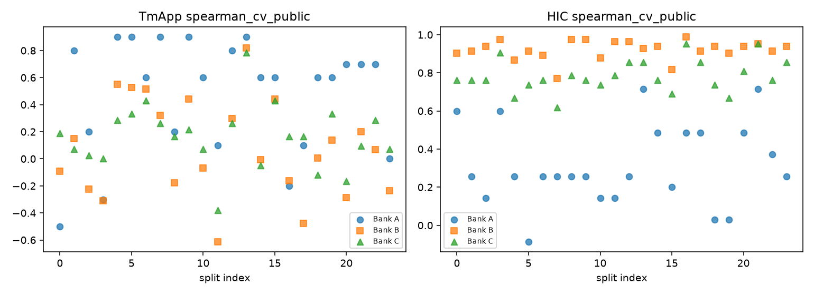
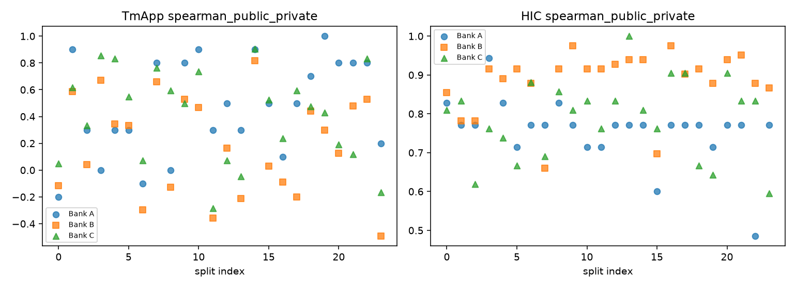
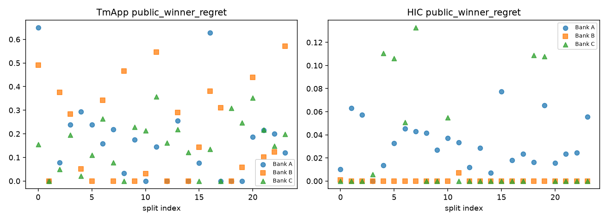

# 05 — Model Bank Safety Validation

Banks A (B5 frozen), B (trained validation), C (stress) evaluated after finalist freeze.

- Catastrophic Pub↔Priv flags: **4** split×target rows

## Summary (mean across banks)

| split_id | target | spearman_cv_public | spearman_public_private | public_winner_regret |
| --- | --- | --- | --- | --- |
| BASELINE_ROLEMAP | HIC | 0.685 | 0.744 | 0.019 |
| BASELINE_ROLEMAP | TmApp | -0.055 | -0.153 | 0.297 |
| CAND_04974 | HIC | 0.873 | 0.852 | 0.008 |
| CAND_04974 | TmApp | 0.332 | 0.466 | 0.178 |
| CAND_12207 | HIC | 0.683 | 0.733 | 0.008 |
| CAND_12207 | TmApp | 0.351 | 0.72 | 0.157 |
| CAND_12528 | HIC | 0.745 | 0.872 | 0.005 |
| CAND_12528 | TmApp | 0.083 | 0.373 | 0.326 |
| GEN_0000_A_20261007 | HIC | 0.755 | 0.831 | 0.004 |
| GEN_0000_A_20261007 | TmApp | -0.133 | -0.089 | 0.431 |
| GEN_0001_B_20271100 | HIC | 0.645 | 0.796 | 0.021 |
| GEN_0001_B_20271100 | TmApp | 0.341 | 0.702 | 0.0 |
| GEN_0002_B_20270923 | HIC | 0.615 | 0.724 | 0.019 |
| GEN_0002_B_20270923 | TmApp | -0.0 | 0.225 | 0.168 |
| GEN_0003_A_20260938 | HIC | 0.827 | 0.873 | 0.002 |
| GEN_0003_A_20260938 | TmApp | -0.203 | 0.51 | 0.239 |
| GEN_0004_B_20271225 | HIC | 0.597 | 0.819 | 0.041 |
| GEN_0004_B_20271225 | TmApp | 0.579 | 0.493 | 0.122 |
| GEN_0005_A_20261232 | HIC | 0.523 | 0.765 | 0.046 |
| GEN_0005_A_20261232 | TmApp | 0.587 | 0.394 | 0.116 |
| GEN_0006_A_20261270 | HIC | 0.637 | 0.844 | 0.032 |
| GEN_0006_A_20261270 | TmApp | 0.515 | -0.109 | 0.254 |
| GEN_0007_B_20271110 | HIC | 0.549 | 0.708 | 0.059 |
| GEN_0007_B_20271110 | TmApp | 0.494 | 0.741 | 0.099 |
| GEN_0008_B_20270925 | HIC | 0.673 | 0.867 | 0.014 |
| GEN_0008_B_20270925 | TmApp | 0.064 | 0.156 | 0.166 |
| GEN_0009_B_20271025 | HIC | 0.665 | 0.852 | 0.009 |
| GEN_0009_B_20271025 | TmApp | 0.519 | 0.609 | 0.135 |
| GEN_0010_B_20270922 | HIC | 0.587 | 0.821 | 0.031 |
| GEN_0010_B_20270922 | TmApp | 0.202 | 0.702 | 0.082 |
| GEN_0011_A_20261282 | HIC | 0.631 | 0.797 | 0.013 |
| GEN_0011_A_20261282 | TmApp | -0.298 | -0.114 | 0.349 |
| GEN_0012_A_20260923 | HIC | 0.693 | 0.844 | 0.004 |
| GEN_0012_A_20260923 | TmApp | 0.453 | 0.245 | 0.054 |
| GEN_0013_A_20260905 | HIC | 0.833 | 0.904 | 0.009 |
| GEN_0013_A_20260905 | TmApp | 0.835 | 0.013 | 0.255 |
| GEN_0014_A_20261275 | HIC | 0.729 | 0.84 | 0.002 |
| GEN_0014_A_20261275 | TmApp | 0.182 | 0.874 | 0.04 |
| GEN_0015_B_20271204 | HIC | 0.57 | 0.686 | 0.026 |
| GEN_0015_B_20271204 | TmApp | 0.49 | 0.351 | 0.073 |
| GEN_0016_A_20261243 | HIC | 0.809 | 0.884 | 0.006 |
| GEN_0016_A_20261243 | TmApp | -0.066 | 0.082 | 0.381 |
| GEN_0017_B_20271055 | HIC | 0.753 | 0.86 | 0.008 |
| GEN_0017_B_20271055 | TmApp | -0.071 | 0.298 | 0.103 |
| GEN_0018_A_20260994 | HIC | 0.569 | 0.784 | 0.042 |
| GEN_0018_A_20260994 | TmApp | 0.162 | 0.54 | 0.103 |
| GEN_0019_B_20271133 | HIC | 0.533 | 0.745 | 0.058 |
| GEN_0019_B_20271133 | TmApp | 0.358 | 0.575 | 0.101 |

## Family LOFO (top-5 + incumbent)

| split_id | bank | target | left_out_family | n_models_kept | spearman_cv_public | spearman_public_private | public_winner_regret |
| --- | --- | --- | --- | --- | --- | --- | --- |
| GEN_0000_A_20261007 | A | TmApp | ensemble | 4 | 0.0 | 0.2 | 0.649 |
| GEN_0000_A_20261007 | A | TmApp | other | 4 | -0.8 | 0.0 | 0.51 |
| GEN_0000_A_20261007 | A | TmApp | plm | 4 | -0.4 | -0.4 | 0.561 |
| GEN_0000_A_20261007 | A | TmApp | seq | 4 | -0.4 | 0.0 | 0.649 |
| GEN_0000_A_20261007 | A | TmApp | simple | 4 | -0.8 | -0.8 | 0.649 |
| GEN_0000_A_20261007 | A | HIC | ensemble | 5 | 0.3 | 0.9 | 0.014 |
| GEN_0000_A_20261007 | A | HIC | plm | 4 | 1.0 | 1.0 | 0.0 |
| GEN_0000_A_20261007 | A | HIC | seq | 5 | 0.3 | 0.7 | 0.01 |
| GEN_0000_A_20261007 | A | HIC | simple | 5 | 0.7 | 0.7 | 0.01 |
| GEN_0000_A_20261007 | A | HIC | structure | 5 | 0.6 | 0.9 | 0.01 |
| GEN_0000_A_20261007 | B | TmApp | bio | 6 | -0.257 | -0.257 | 0.513 |
| GEN_0000_A_20261007 | B | TmApp | plm | 7 | 0.5 | 0.393 | 0.101 |
| GEN_0000_A_20261007 | B | TmApp | seq | 8 | 0.0 | -0.048 | 0.491 |
| GEN_0000_A_20261007 | B | TmApp | simple | 9 | -0.267 | -0.383 | 0.491 |
| GEN_0000_A_20261007 | B | HIC | plm | 8 | 0.881 | 0.905 | 0.0 |
| GEN_0000_A_20261007 | B | HIC | seq | 7 | 0.857 | 0.714 | 0.001 |
| GEN_0000_A_20261007 | B | HIC | simple | 9 | 0.917 | 0.85 | 0.001 |
| GEN_0000_A_20261007 | B | HIC | structure | 6 | 1.0 | 1.0 | 0.0 |
| GEN_0001_B_20271100 | A | TmApp | ensemble | 4 | 0.8 | 0.8 | 0.0 |
| GEN_0001_B_20271100 | A | TmApp | other | 4 | 0.6 | 1.0 | 0.0 |
| GEN_0001_B_20271100 | A | TmApp | plm | 4 | 0.8 | 0.8 | 0.0 |
| GEN_0001_B_20271100 | A | TmApp | seq | 4 | 0.8 | 1.0 | 0.0 |
| GEN_0001_B_20271100 | A | TmApp | simple | 4 | 0.8 | 0.8 | 0.0 |
| GEN_0001_B_20271100 | A | HIC | ensemble | 5 | 0.1 | 0.9 | 0.063 |
| GEN_0001_B_20271100 | A | HIC | plm | 4 | 1.0 | 0.8 | 0.023 |
| GEN_0001_B_20271100 | A | HIC | seq | 5 | -0.3 | 0.6 | 0.063 |
| GEN_0001_B_20271100 | A | HIC | simple | 5 | 0.3 | 0.6 | 0.063 |
| GEN_0001_B_20271100 | A | HIC | structure | 5 | 0.3 | 0.9 | 0.04 |
| GEN_0001_B_20271100 | B | TmApp | bio | 6 | 0.371 | 0.6 | 0.0 |
| GEN_0001_B_20271100 | B | TmApp | plm | 7 | 0.25 | 0.571 | 0.089 |
| GEN_0001_B_20271100 | B | TmApp | seq | 8 | 0.286 | 0.69 | 0.0 |
| GEN_0001_B_20271100 | B | TmApp | simple | 9 | 0.067 | 0.567 | 0.0 |
| GEN_0001_B_20271100 | B | HIC | plm | 8 | 0.929 | 0.81 | 0.0 |
| GEN_0001_B_20271100 | B | HIC | seq | 7 | 0.893 | 0.857 | 0.0 |
| GEN_0001_B_20271100 | B | HIC | simple | 9 | 0.883 | 0.7 | 0.0 |
| GEN_0001_B_20271100 | B | HIC | structure | 6 | 0.943 | 0.829 | 0.0 |
| GEN_0002_B_20270923 | A | TmApp | ensemble | 4 | 0.8 | 0.8 | 0.0 |
| GEN_0002_B_20270923 | A | TmApp | other | 4 | 0.0 | 0.4 | 0.078 |
| GEN_0002_B_20270923 | A | TmApp | plm | 4 | 0.0 | 0.2 | 0.556 |
| GEN_0002_B_20270923 | A | TmApp | seq | 4 | 0.4 | 0.4 | 0.078 |
