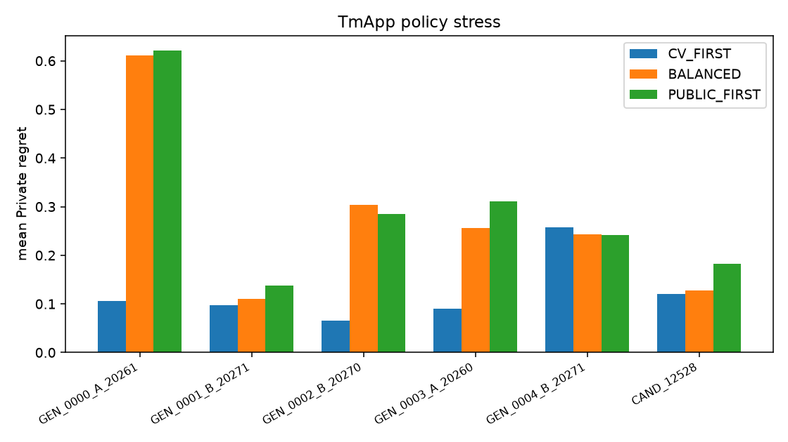
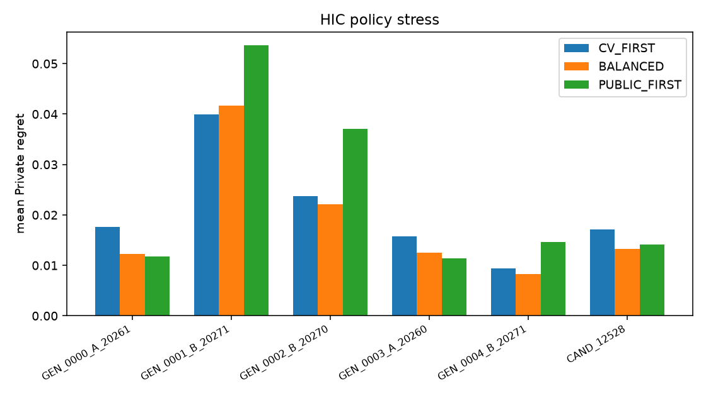

# 06 — Policy Stress Test

≥500 random development trajectories per target × split; policies CV_FIRST / BALANCED / PUBLIC_FIRST.

| split_id | target | policy | n_traj | mean_private_regret | median_private_regret | p90_private_regret | mean_bsf_private_regret | frac_zero_regret |
| --- | --- | --- | --- | --- | --- | --- | --- | --- |
| GEN_0000_A_20261007 | TmApp | CV_FIRST | 500 | 0.1064 | 0.0879 | 0.1208 | 0.089 | 0.128 |
| GEN_0000_A_20261007 | TmApp | BALANCED | 500 | 0.6117 | 0.6117 | 0.6491 | 0.4084 | 0.018 |
| GEN_0000_A_20261007 | TmApp | PUBLIC_FIRST | 500 | 0.6207 | 0.6117 | 0.6491 | 0.4722 | 0.0 |
| GEN_0000_A_20261007 | HIC | CV_FIRST | 500 | 0.0177 | 0.0102 | 0.0342 | 0.012 | 0.0 |
| GEN_0000_A_20261007 | HIC | BALANCED | 500 | 0.0123 | 0.0102 | 0.0143 | 0.0089 | 0.01 |
| GEN_0000_A_20261007 | HIC | PUBLIC_FIRST | 500 | 0.0117 | 0.0102 | 0.0143 | 0.0088 | 0.054 |
| GEN_0001_B_20271100 | TmApp | CV_FIRST | 500 | 0.0977 | 0.0689 | 0.128 | 0.08 | 0.128 |
| GEN_0001_B_20271100 | TmApp | BALANCED | 500 | 0.11 | 0.128 | 0.128 | 0.0823 | 0.242 |
| GEN_0001_B_20271100 | TmApp | PUBLIC_FIRST | 500 | 0.1372 | 0.128 | 0.2825 | 0.1002 | 0.242 |
| GEN_0001_B_20271100 | HIC | CV_FIRST | 500 | 0.04 | 0.0448 | 0.0548 | 0.0339 | 0.012 |
| GEN_0001_B_20271100 | HIC | BALANCED | 500 | 0.0417 | 0.0448 | 0.0706 | 0.0337 | 0.014 |
| GEN_0001_B_20271100 | HIC | PUBLIC_FIRST | 500 | 0.0536 | 0.063 | 0.063 | 0.0399 | 0.01 |
| GEN_0002_B_20270923 | TmApp | CV_FIRST | 500 | 0.0659 | 0.0511 | 0.1295 | 0.0577 | 0.292 |
| GEN_0002_B_20270923 | TmApp | BALANCED | 500 | 0.3034 | 0.1295 | 0.607 | 0.2234 | 0.008 |
| GEN_0002_B_20270923 | TmApp | PUBLIC_FIRST | 500 | 0.2854 | 0.3754 | 0.4949 | 0.2587 | 0.0 |
| GEN_0002_B_20270923 | HIC | CV_FIRST | 500 | 0.0238 | 0.0271 | 0.0515 | 0.0173 | 0.476 |
| GEN_0002_B_20270923 | HIC | BALANCED | 500 | 0.0221 | 0.0271 | 0.0515 | 0.0159 | 0.3 |
| GEN_0002_B_20270923 | HIC | PUBLIC_FIRST | 500 | 0.037 | 0.0411 | 0.0572 | 0.0226 | 0.064 |
| GEN_0003_A_20260938 | TmApp | CV_FIRST | 500 | 0.0901 | 0.0652 | 0.2385 | 0.0877 | 0.492 |
| GEN_0003_A_20260938 | TmApp | BALANCED | 500 | 0.2563 | 0.2385 | 0.4242 | 0.2064 | 0.0 |
| GEN_0003_A_20260938 | TmApp | PUBLIC_FIRST | 500 | 0.3113 | 0.2385 | 0.5064 | 0.27 | 0.0 |
| GEN_0003_A_20260938 | HIC | CV_FIRST | 500 | 0.0158 | 0.0 | 0.0372 | 0.0108 | 0.512 |
| GEN_0003_A_20260938 | HIC | BALANCED | 500 | 0.0126 | 0.0186 | 0.0271 | 0.0073 | 0.364 |
| GEN_0003_A_20260938 | HIC | PUBLIC_FIRST | 500 | 0.0114 | 0.0186 | 0.0186 | 0.0068 | 0.254 |
| GEN_0004_B_20271225 | TmApp | CV_FIRST | 500 | 0.258 | 0.2935 | 0.2935 | 0.1905 | 0.14 |
| GEN_0004_B_20271225 | TmApp | BALANCED | 500 | 0.2438 | 0.2935 | 0.2935 | 0.1754 | 0.14 |
| GEN_0004_B_20271225 | TmApp | PUBLIC_FIRST | 500 | 0.2421 | 0.2935 | 0.2935 | 0.1734 | 0.14 |
| GEN_0004_B_20271225 | HIC | CV_FIRST | 500 | 0.0094 | 0.0 | 0.0329 | 0.0075 | 0.538 |
| GEN_0004_B_20271225 | HIC | BALANCED | 500 | 0.0082 | 0.0102 | 0.0136 | 0.0071 | 0.476 |
| GEN_0004_B_20271225 | HIC | PUBLIC_FIRST | 500 | 0.0146 | 0.0136 | 0.0192 | 0.0108 | 0.144 |
| CAND_12528 | TmApp | CV_FIRST | 500 | 0.1211 | 0.1862 | 0.1862 | 0.083 | 0.128 |
| CAND_12528 | TmApp | BALANCED | 500 | 0.1271 | 0.1862 | 0.1862 | 0.0842 | 0.29 |
| CAND_12528 | TmApp | PUBLIC_FIRST | 500 | 0.1829 | 0.1862 | 0.4697 | 0.1193 | 0.29 |
| CAND_12528 | HIC | CV_FIRST | 500 | 0.0172 | 0.0 | 0.0422 | 0.0117 | 0.506 |
| CAND_12528 | HIC | BALANCED | 500 | 0.0133 | 0.0124 | 0.0422 | 0.009 | 0.366 |
| CAND_12528 | HIC | PUBLIC_FIRST | 500 | 0.0141 | 0.0155 | 0.0155 | 0.0096 | 0.142 |

