# Round 1 — CV / Public / Private Model Score Correlation

Organizer reveal 後の postmortem diagnostic。モデルは **pre-reveal frozen**（hash freeze 済み Test prediction）と **post-reveal exploratory**（reveal 後に生成）を区別。後者を用いた「Round1 で選ばれていたはず」という遡及的主張は行わない。

## 1. 何を比較したか

Stage1–Stage5 の registry 上 formal experiment について、model-level MAE（Primary CV / Shadow CV / Public / Private / All Test）の散布・相関・順位逆転を **descriptive** に分析。各点は独立サンプルではなく、p-value 中心の推論は行わない。

## 2. 対象モデル数

### TmApp

- **全モデル:** 174
- **pre-reveal frozen:** 3
- **post-reveal exploratory:** 108
- **CV-only（Test 未生成）:** 63
- Stage別: Stage1=57, Stage2=17, Stage2b=6, Stage3=43, Stage4=23, Stage5=28

### HIC

- **全モデル:** 180
- **pre-reveal frozen:** 3
- **post-reveal exploratory:** 122
- **CV-only（Test 未生成）:** 55
- Stage別: Stage1=53, Stage2=23, Stage2b=8, Stage3=43, Stage4=25, Stage5=28

## 3. TmApp pairplot

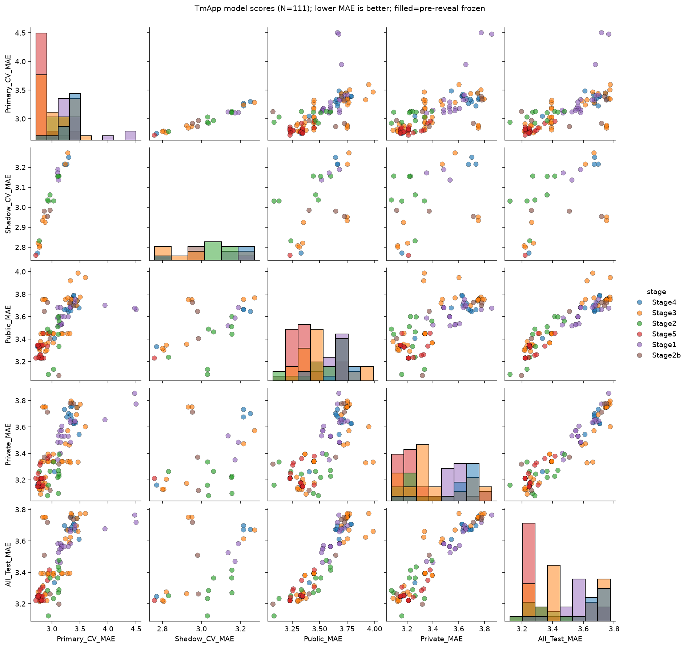

## 5. HIC pairplot

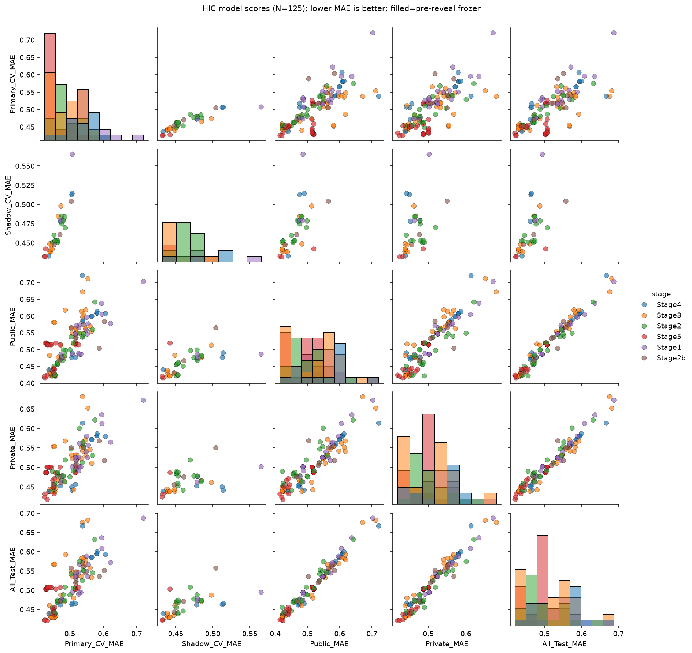

## 4. TmApp 相関係数

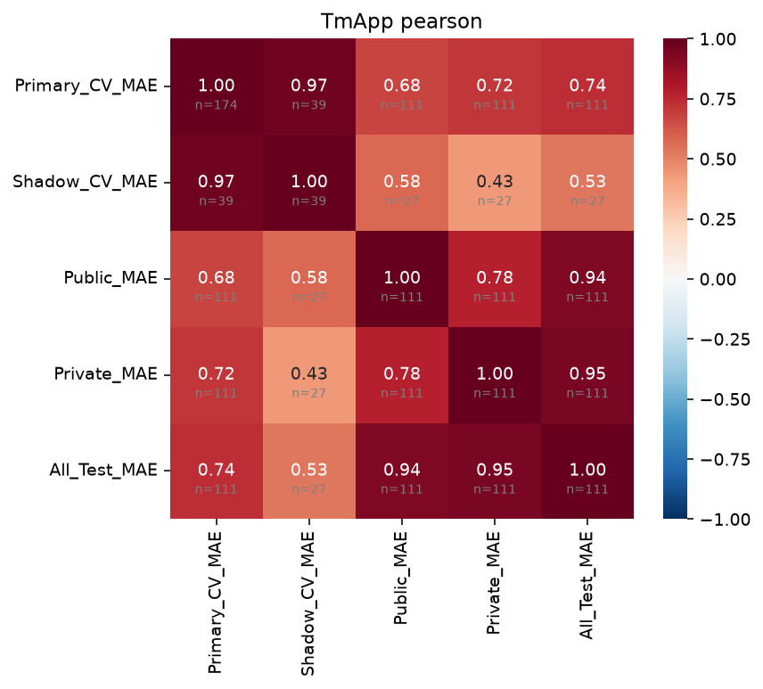

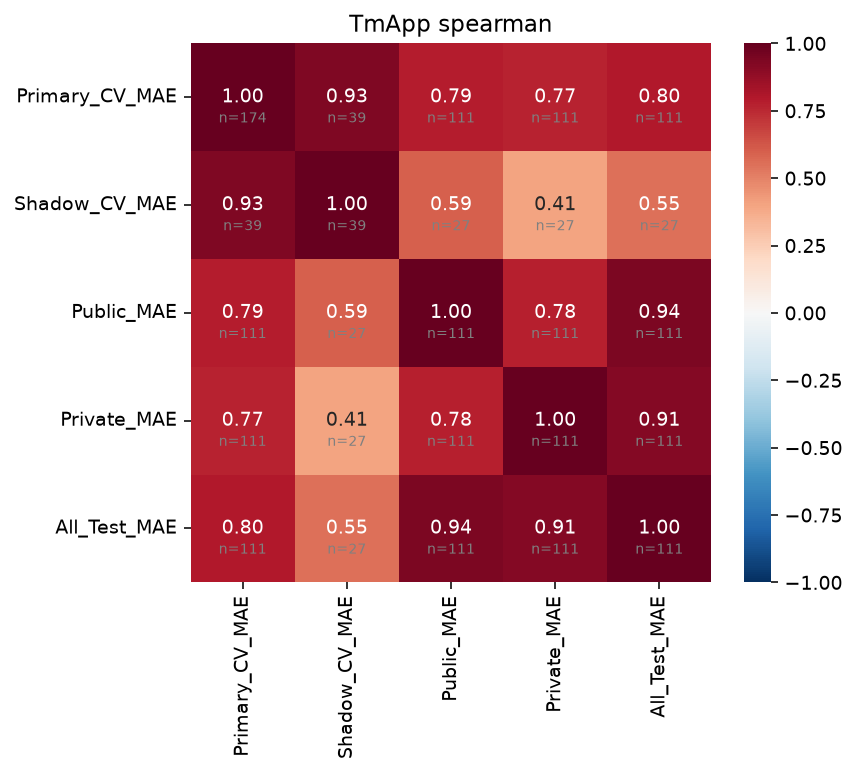

## 6. HIC 相関係数

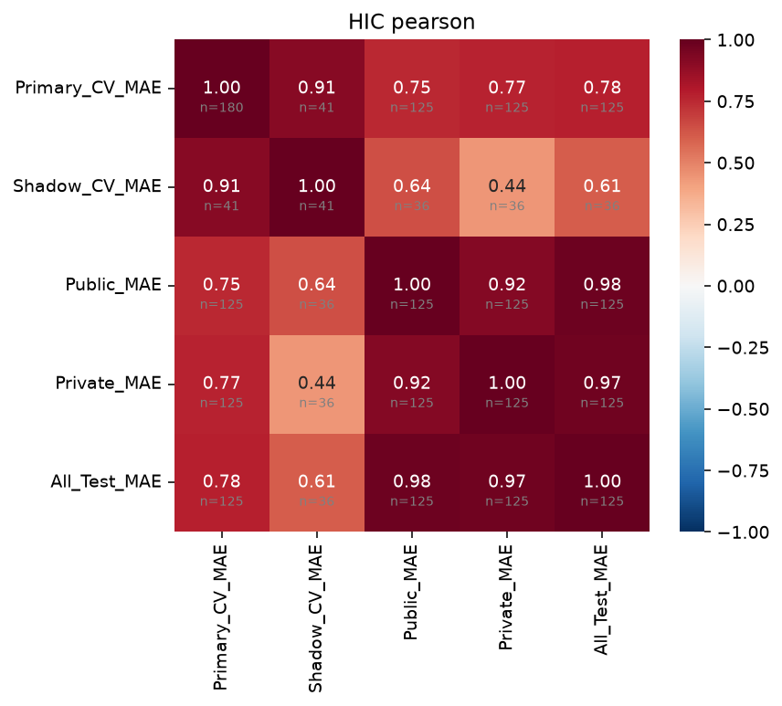

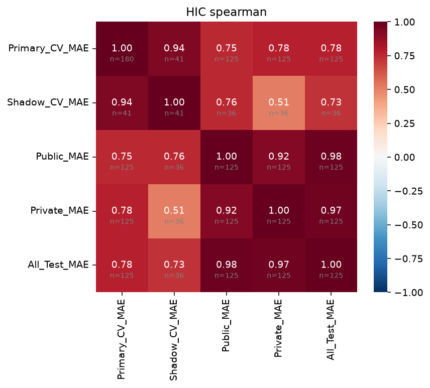

## 7. Primary CV と Private の関係

- **TmApp (Q1):** Pearson=0.719, Spearman=0.769, N=111
- **HIC (Q3):** Pearson=0.770, Spearman=0.779, N=125
- **TmApp gap (Q7):** median gap=0.338, mean=0.312, fraction models with gap>0.3: 0.61 — Yes — gap is positive for majority of models

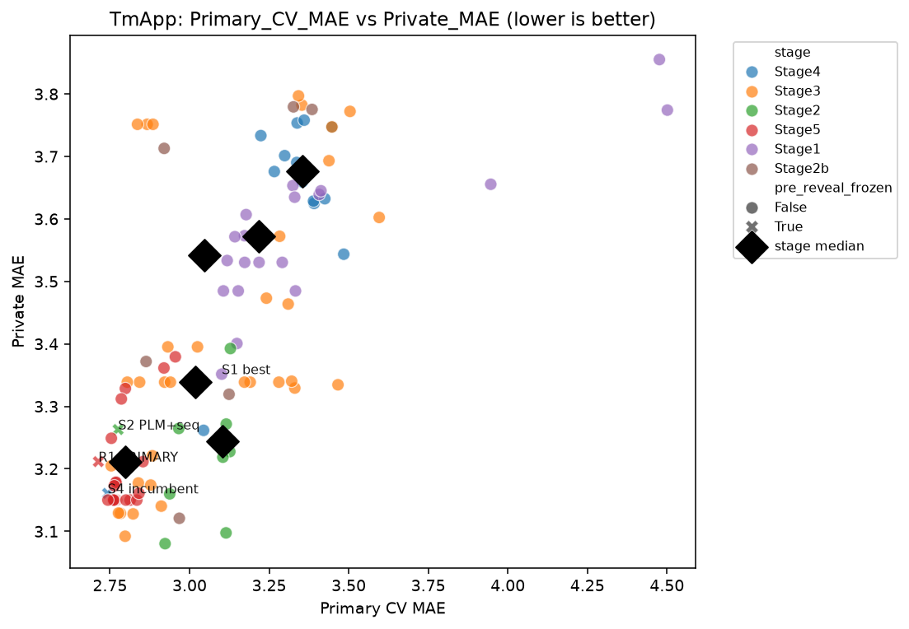

## 8. Shadow CV と Private の関係

- **TmApp (Q2):** Pearson=0.431, Spearman=0.405, N=27 — Shadow > Primary? **No**
- **HIC (Q4):** Pearson=0.443, Spearman=0.515, N=36 — Shadow > Primary? **No**

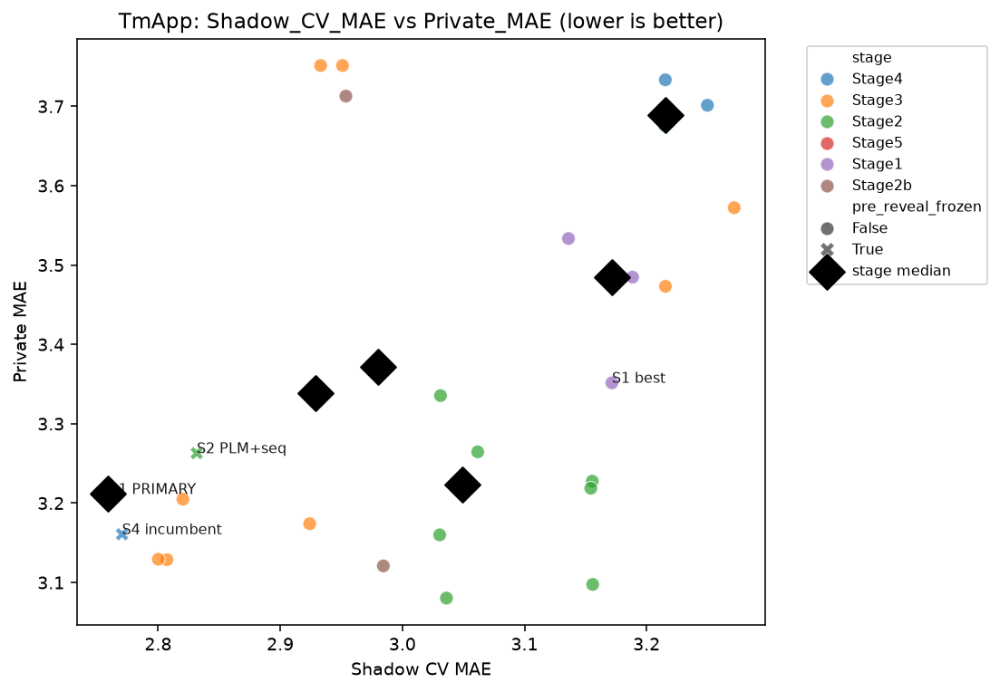

## 9. Public と Private の関係

- **TmApp (Q5):** Pearson=0.779, Spearman=0.780, N=111
- **HIC:** Pearson=0.918, Spearman=0.916, N=125

## 10. Stage ごとの性能推移

**Q6:** TmApp: median Primary CV 改善、median Private 改善; HIC: median Primary CV 改善、median Private 改善

| target   | stage   |   N_models |   median_Primary_CV_MAE |   best_Primary_CV_MAE |   median_Shadow_CV_MAE |   best_Shadow_CV_MAE |   median_Public_MAE |   best_Public_MAE |   median_Private_MAE |   best_Private_MAE |   median_All_Test_MAE |   best_All_Test_MAE |
|:---------|:--------|-----------:|------------------------:|----------------------:|-----------------------:|---------------------:|--------------------:|------------------:|---------------------:|-------------------:|----------------------:|--------------------:|
| TmApp    | Stage1  |         57 |                   3.281 |                 3.101 |                  3.172 |                3.136 |               3.663 |             3.518 |                3.572 |              3.352 |                 3.582 |               3.463 |
| TmApp    | Stage2  |         17 |                   3.105 |                 2.776 |                  3.099 |                2.832 |               3.463 |             3.085 |                3.244 |              3.080 |                 3.289 |               3.123 |
| TmApp    | Stage2b |          6 |                   3.046 |                 2.863 |                  2.980 |                2.954 |               3.673 |             3.075 |                3.542 |              3.121 |                 3.614 |               3.197 |
| TmApp    | Stage3  |         43 |                   3.191 |                 2.754 |                  2.933 |                2.800 |               3.447 |             3.292 |                3.339 |              3.092 |                 3.393 |               3.215 |
| TmApp    | Stage4  |         23 |                   3.266 |                 2.743 |                  3.023 |                2.770 |               3.700 |             3.332 |                3.676 |              3.161 |                 3.688 |               3.246 |
| TmApp    | Stage5  |         28 |                   2.789 |                 2.713 |                  2.769 |                2.759 |               3.328 |             3.231 |                3.212 |              3.150 |                 3.248 |               3.221 |
| HIC      | Stage1  |         53 |                   0.538 |                 0.473 |                  0.480 |                0.472 |               0.558 |             0.477 |                0.525 |              0.463 |                 0.545 |               0.474 |
| HIC      | Stage2  |         23 |                   0.481 |                 0.448 |                  0.457 |                0.451 |               0.483 |             0.422 |                0.485 |              0.441 |                 0.477 |               0.439 |
| HIC      | Stage2b |          8 |                   0.518 |                 0.453 |                  0.461 |                0.448 |               0.534 |             0.431 |                0.514 |              0.456 |                 0.529 |               0.443 |
| HIC      | Stage3  |         43 |                   0.508 |                 0.440 |                  0.442 |                0.438 |               0.549 |             0.421 |                0.523 |              0.438 |                 0.536 |               0.430 |
| HIC      | Stage4  |         25 |                   0.539 |                 0.437 |                  0.457 |                0.433 |               0.589 |             0.440 |                0.561 |              0.439 |                 0.575 |               0.439 |
| HIC      | Stage5  |         28 |                   0.445 |                 0.425 |                  0.433 |                0.432 |               0.514 |             0.415 |                0.487 |              0.418 |                 0.503 |               0.421 |

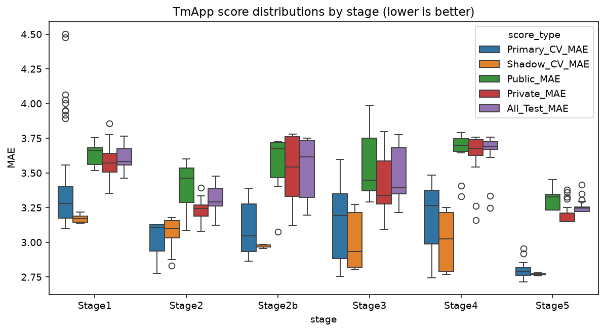

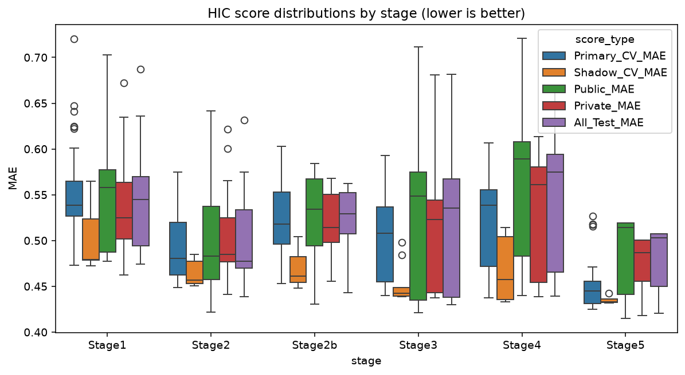

## 11. CV 順位と Test 順位の逆転

最大の Primary→Private rank reversal: **TmApp__ESMFold__STRUCT_SURFACE_ALL__RidgeOpt (Primary rank 157 → Private 47)**

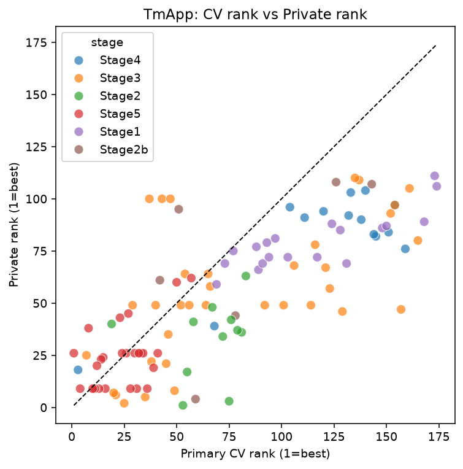

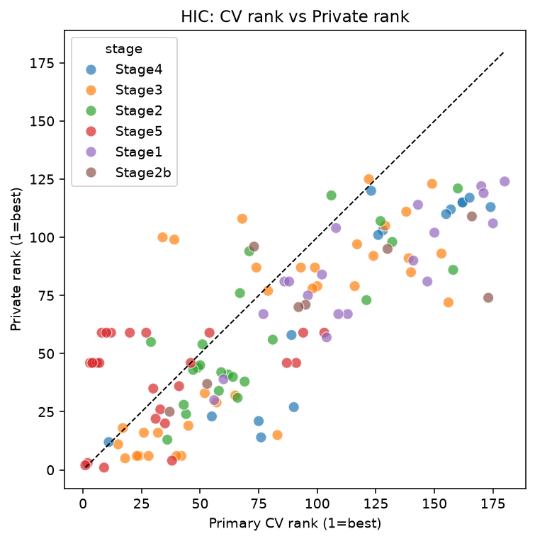

## 12. Pre-reveal frozen model だけで見るとどうか

TmApp pre-reveal N=3 Primary-Private r=0.533; HIC pre-reveal N=3 Primary-Private r=1.000

N が小さいため相関は参考値。詳細: `round1_prereveal_score_correlations_*.csv`

## CV ensemble 指標（Q9 / §19 diagnostic）

TmApp CV_MEAN vs Private: r=0.447, rho=0.409; TmApp CV_WORST vs Private: r=0.451, rho=0.407; TmApp worst-of-two improves over Primary? No; HIC CV_MEAN vs Private: r=0.507, rho=0.534; HIC CV_WORST vs Private: r=0.509, rho=0.562; HIC worst-of-two improves over Primary? No

Key pairs 全表:

| Target   | X              | Y             |   Pearson_r |   Spearman_rho |   N |
|:---------|:---------------|:--------------|------------:|---------------:|----:|
| TmApp    | Primary_CV_MAE | Shadow_CV_MAE |       0.974 |          0.930 |  39 |
| TmApp    | Primary_CV_MAE | Public_MAE    |       0.676 |          0.785 | 111 |
| TmApp    | Primary_CV_MAE | Private_MAE   |       0.719 |          0.769 | 111 |
| TmApp    | Primary_CV_MAE | All_Test_MAE  |       0.740 |          0.804 | 111 |
| TmApp    | Shadow_CV_MAE  | Public_MAE    |       0.576 |          0.594 |  27 |
| TmApp    | Shadow_CV_MAE  | Private_MAE   |       0.431 |          0.405 |  27 |
| TmApp    | Shadow_CV_MAE  | All_Test_MAE  |       0.534 |          0.550 |  27 |
| TmApp    | Public_MAE     | Private_MAE   |       0.779 |          0.780 | 111 |
| TmApp    | Public_MAE     | All_Test_MAE  |       0.937 |          0.944 | 111 |
| TmApp    | Private_MAE    | All_Test_MAE  |       0.949 |          0.915 | 111 |
| TmApp    | CV_MEAN        | Public_MAE    |       0.561 |          0.566 |  27 |
| TmApp    | CV_MEAN        | Private_MAE   |       0.447 |          0.409 |  27 |
| TmApp    | CV_MEAN        | All_Test_MAE  |       0.536 |          0.521 |  27 |
| TmApp    | CV_WORST       | Public_MAE    |       0.581 |          0.586 |  27 |
| TmApp    | CV_WORST       | Private_MAE   |       0.451 |          0.407 |  27 |
| TmApp    | CV_WORST       | All_Test_MAE  |       0.548 |          0.552 |  27 |
| HIC      | Primary_CV_MAE | Shadow_CV_MAE |       0.913 |          0.936 |  41 |
| HIC      | Primary_CV_MAE | Public_MAE    |       0.752 |          0.753 | 125 |
| HIC      | Primary_CV_MAE | Private_MAE   |       0.770 |          0.779 | 125 |
| HIC      | Primary_CV_MAE | All_Test_MAE  |       0.776 |          0.778 | 125 |
| HIC      | Shadow_CV_MAE  | Public_MAE    |       0.644 |          0.755 |  36 |
| HIC      | Shadow_CV_MAE  | Private_MAE   |       0.443 |          0.515 |  36 |
| HIC      | Shadow_CV_MAE  | All_Test_MAE  |       0.609 |          0.726 |  36 |
| HIC      | Public_MAE     | Private_MAE   |       0.918 |          0.916 | 125 |
| HIC      | Public_MAE     | All_Test_MAE  |       0.983 |          0.977 | 125 |
| HIC      | Private_MAE    | All_Test_MAE  |       0.974 |          0.974 | 125 |
| HIC      | CV_MEAN        | Public_MAE    |       0.665 |          0.730 |  36 |
| HIC      | CV_MEAN        | Private_MAE   |       0.507 |          0.534 |  36 |
| HIC      | CV_MEAN        | All_Test_MAE  |       0.652 |          0.726 |  36 |
| HIC      | CV_WORST       | Public_MAE    |       0.652 |          0.762 |  36 |
| HIC      | CV_WORST       | Private_MAE   |       0.509 |          0.562 |  36 |
| HIC      | CV_WORST       | All_Test_MAE  |       0.645 |          0.753 |  36 |

## 13. Round1 CV protocol から学べること

1. 各 model 点は独立ではない（同一 Dev / feature family を共有）。
2. 相関係数は descriptive のみ。
3. pre-reveal frozen N=6 の subset では推定が不安定。
4. ALL MODELS 解析に post-reveal exploratory を含むため exploratory。
5. Public / Private は各 N=81 で ranking に sampling variation あり。

## 14. Round2 への示唆

TmApp: Primary CV は rank 予測力は高い（Private と r≈0.72）が、**絶対 MAE を系統的に過小評価**（median gap≈+0.34、94% の model で Private>Primary）。 Shadow / CV mean / worst-of-two は本データでは Private 相関が **Primary より低い**（Shadow N も少ない）。 Round2 では gap 自体の監視（calibration diagnostic）と、Public–Private 乖離への耐性を重視。 HIC: Primary↔Private 整合は良好（r≈0.77、median gap≈0）。Primary 中心 selection で十分。 Public–Private ranking は TmApp r≈0.78 / HIC r≈0.92 と高いが各 N=81 の sampling variation に注意。

## 付録: 外れモデル（post-hoc）

| category                   | target   | experiment_id                                       | stage   |   Primary_CV_MAE |   Private_MAE |   cv_private_gap |   Public_MAE |   pub_vs_median |   Shadow_CV_MAE |   shadow_priv_gap |
|:---------------------------|:---------|:----------------------------------------------------|:--------|-----------------:|--------------:|-----------------:|-------------:|----------------:|----------------:|------------------:|
| A_good_CV_bad_Private      | TmApp    | TmApp__META_performance__ridge_100.0                | Stage5  |            2.713 |         3.212 |            0.498 |      nan     |         nan     |         nan     |           nan     |
| A_good_CV_bad_Private      | TmApp    | TmApp__META_performance__ridge_10.0                 | Stage5  |            2.754 |         3.249 |            0.495 |      nan     |         nan     |         nan     |           nan     |
| A_good_CV_bad_Private      | TmApp    | TmApp__FUSION_OVERALL__ESMFold__STRUCT_RASA__SVROpt | Stage3  |            2.754 |         3.205 |            0.451 |      nan     |         nan     |         nan     |           nan     |
| A_good_CV_bad_Private      | TmApp    | TmApp__FUSION_S3INC__ADV_INTERACTIONS__SVROpt       | Stage4  |            2.743 |         3.161 |            0.418 |      nan     |         nan     |         nan     |           nan     |
| A_good_CV_bad_Private      | TmApp    | TmApp__META_diversity__ridge_10.0                   | Stage5  |            2.764 |         3.173 |            0.409 |      nan     |         nan     |         nan     |           nan     |
| A_good_CV_bad_Private      | TmApp    | TmApp__META_diversity__ridge_100.0                  | Stage5  |            2.743 |         3.150 |            0.407 |      nan     |         nan     |         nan     |           nan     |
| A_good_CV_bad_Private      | TmApp    | TmApp__META_diversity__quantile_0.001               | Stage5  |            2.761 |         3.150 |            0.389 |      nan     |         nan     |         nan     |           nan     |
| A_good_CV_bad_Private      | TmApp    | TmApp__META_diversity__quantile_0.0                 | Stage5  |            2.762 |         3.150 |            0.388 |      nan     |         nan     |         nan     |           nan     |
| B_mediocre_CV_good_Private | TmApp    | TmApp__FUSION__esm1b__HL__SEQ_BASIC__SVROpt         | Stage2  |            3.115 |         3.098 |          nan     |      nan     |         nan     |         nan     |           nan     |
| B_mediocre_CV_good_Private | TmApp    | TmApp__esm1b__HL__SVROpt                            | Stage2  |            3.105 |         3.219 |          nan     |      nan     |         nan     |         nan     |           nan     |
| B_mediocre_CV_good_Private | TmApp    | TmApp__FUSION__esm2__HL__SEQ_BASIC__SVROpt          | Stage2  |            3.126 |         3.228 |          nan     |      nan     |         nan     |         nan     |           nan     |
| B_mediocre_CV_good_Private | TmApp    | TmApp__esm1b__HL__RidgeOpt                          | Stage2  |            3.125 |         3.244 |          nan     |      nan     |         nan     |         nan     |           nan     |
| B_mediocre_CV_good_Private | TmApp    | TmApp__esm2__HL__SVROpt                             | Stage2  |            3.115 |         3.272 |          nan     |      nan     |         nan     |         nan     |           nan     |
| B_mediocre_CV_good_Private | TmApp    | TmApp__ablang2__HL__SVROpt_PCA64                    | Stage2b |            3.124 |         3.319 |          nan     |      nan     |         nan     |         nan     |           nan     |
| B_mediocre_CV_good_Private | TmApp    | TmApp__ESMFold__STRUCT_RASA__RidgeOpt               | Stage3  |            3.331 |         3.329 |          nan     |      nan     |         nan     |         nan     |           nan     |
| B_mediocre_CV_good_Private | TmApp    | TmApp__ESMFold__STRUCT_SURFACE_ALL__RidgeOpt        | Stage3  |            3.466 |         3.335 |          nan     |      nan     |         nan     |         nan     |           nan     |
| C_public_extreme           | TmApp    | TmApp__ablang2__HL__SVROpt_PCA64                    | Stage2b |          nan     |         3.319 |          nan     |        3.075 |          -0.388 |         nan     |           nan     |
| C_public_extreme           | TmApp    | TmApp__ablang2__HL__RidgeOpt                        | Stage2  |          nan     |         3.160 |          nan     |        3.085 |          -0.378 |         nan     |           nan     |
| C_public_extreme           | TmApp    | TmApp__ablang2__HL__SVROpt                          | Stage2  |          nan     |         3.335 |          nan     |        3.131 |          -0.332 |         nan     |           nan     |
| C_public_extreme           | TmApp    | TmApp__META_performance__convex_mae                 | Stage5  |          nan     |         3.212 |          nan     |        3.231 |          -0.233 |         nan     |           nan     |
| C_public_extreme           | TmApp    | TmApp__META_performance__nnls                       | Stage5  |          nan     |         3.212 |          nan     |        3.231 |          -0.233 |         nan     |           nan     |
| C_public_extreme           | TmApp    | TmApp__ESMFold__STRUCT_SURFACE_ALL__RidgeOpt        | Stage3  |          nan     |         3.335 |          nan     |        3.987 |           0.524 |         nan     |           nan     |
| C_public_extreme           | TmApp    | TmApp__ESMFold__STRUCT_SURFACE_CHEM__RidgeOpt       | Stage3  |          nan     |         3.602 |          nan     |        3.947 |           0.484 |         nan     |           nan     |
| C_public_extreme           | TmApp    | TmApp__ESMFold__STRUCT_RASA__RidgeOpt               | Stage3  |          nan     |         3.329 |          nan     |        3.918 |           0.455 |         nan     |           nan     |
| C_public_extreme           | TmApp    | TmApp__ADV_CAVITY__ElasticNetOpt                    | Stage4  |          nan     |         3.625 |          nan     |        3.789 |           0.326 |         nan     |           nan     |
| C_public_extreme           | TmApp    | TmApp__ADV_CAVITY__RidgeOpt                         | Stage4  |          nan     |         3.629 |          nan     |        3.784 |           0.320 |         nan     |           nan     |
| D_shadow_private_match     | TmApp    | TmApp__ablang2__HL_paired__SVROpt                   | Stage2  |          nan     |         3.080 |          nan     |      nan     |         nan     |           3.036 |             0.044 |
| D_shadow_private_match     | TmApp    | TmApp__FUSION__esm1b__HL__SEQ_BASIC__SVROpt         | Stage2  |          nan     |         3.098 |          nan     |      nan     |         nan     |           3.156 |             0.058 |
| D_shadow_private_match     | TmApp    | TmApp__esm1b__HL__SVROpt                            | Stage2  |          nan     |         3.219 |          nan     |      nan     |         nan     |           3.154 |             0.064 |
| D_shadow_private_match     | TmApp    | TmApp__FUSION__esm2__HL__SEQ_BASIC__SVROpt          | Stage2  |          nan     |         3.228 |          nan     |      nan     |         nan     |           3.156 |             0.072 |

**状態:** `ROUND1_MODEL_SCORE_CORRELATION_ANALYSIS_COMPLETE`
